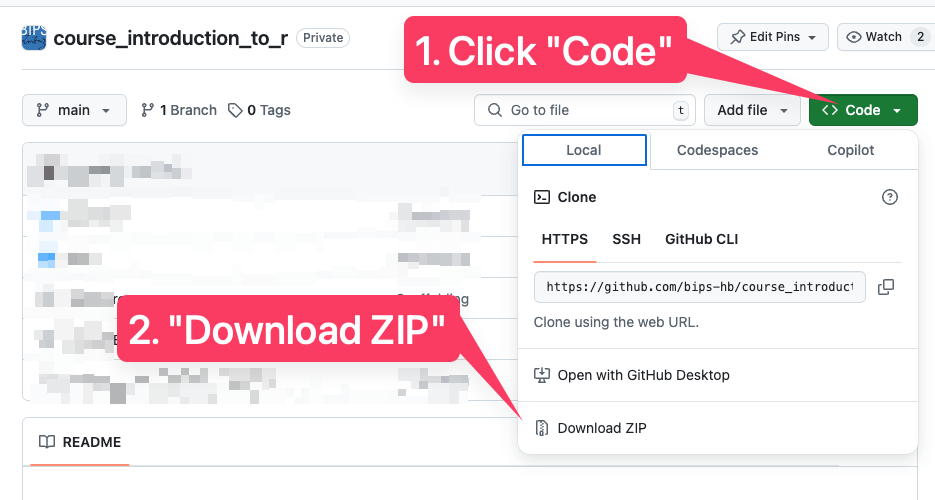
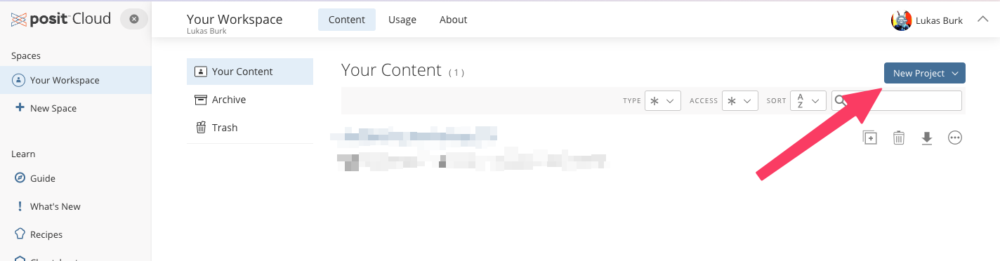
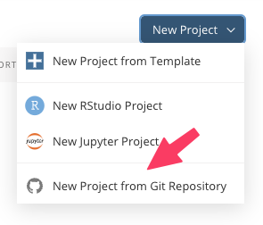

# Introduction to R

Introduction to data management and data analysis with R and RStudio.

## Outline

The course is grouped into (potentially overlapping) sections which do not necessarily need to correspond to workshop days.  
The sections are:

### 1. Getting started  

- Setting up R and RStudio and getting familiar with RStudio as an environment  
- Basic R syntax and common language features such as the included help system  
- Essential data types and data structures  
- Familiarization with example datasets used throughout the course  
- Using [Quarto](https://quarto.org/) as the environment for code examples and exercises  

### 2. Exploratory data analysis  

- Creating and manipulating tabular data with the tidyverse  
- Preparing for typical data cleaning tasks  
- Data visualization basics using ggplot2  
- Descriptive statistics to understand one's data 
- Assess data integrity  
- Paving the way for publication-ready tables and visualizations using extension packages  

### 3. Statistical analysis  

- Basic hypothesis testing for common research questions  

## Prerequisites

Ideally R and RStudio are already installed at the start of the course. See [these instructions](https://lukasburk.de/posts/install-r/) for example.

If a local setup is not feasible, consider using an online service such as [Posit Cloud](https://posit.cloud/) (see below).

## How to use this repository

Depending on your setup, you can either work with these materials *locally* on your own computer or in the browser on a cloud service, [Posit Cloud](https://posit.cloud/).

Follow these instructions depending on your preferences / needs:

### Locally with R / RStudio installed

- On this site (<https://github.com/bips-hb/course_introduction_to_r>), click the green "Code" button and choose "Download ZIP"
- Extract the downloaded ZIP file
- Double-click `course_introduction_to_r.Rproj`

### Using posit.cloud

Log in on <https://posit.cloud> using whichever method you prefer (it's free!)

## Additional materials

### Introductory courses

- [R Crash Course](https://r-crash-course.github.io/)
- [The R Workshop](https://www.r-workshop.org/) by Rebecca L. Barter

### Books

- [R for Data Science](https://r4ds.hadley.nz/) by Hadley Wickham et al.
- [Advanced R](https://adv-r.hadley.nz/) by Hadley Wickham
- [What They Forgot to Teach You About R](https://rstats.wtf/) by Jennifer Bryan et al.
